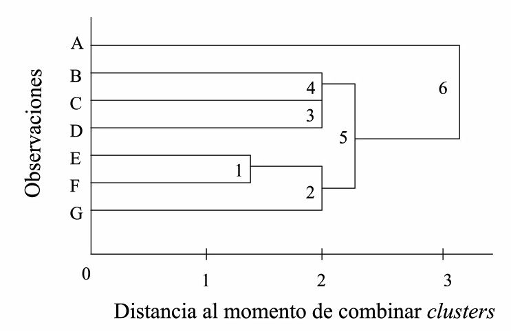
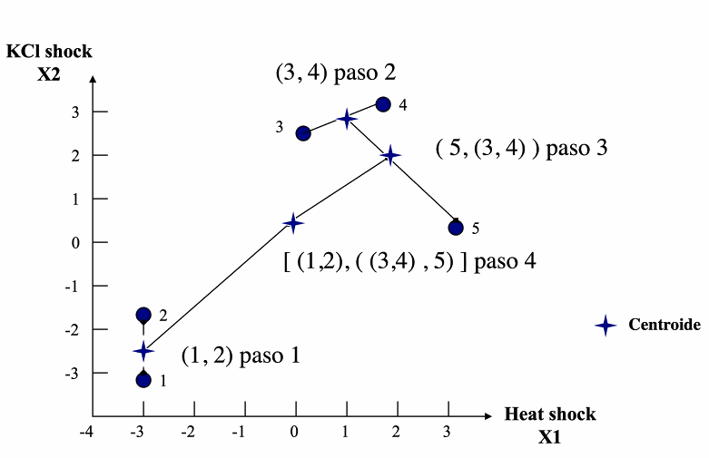

# Análisis de Clusters y su papel en el proceso de minería de datos y desubrimiento de conocimiento 

- ¿Cómo medir la similitud entre observaciones? 
- ¿Cómo definir los cluster?
- ¿Cuántos grupos? 


## Etapas del análisis de cluster 

- Selección de atributos 
  - Identificación del conjunto óptimo de variables para agrupar los datos 
- Extracción de atributos 
  - Transformación/normalización de variables de entrada para producir nuevas variables
- Similitud entre objetos 
  - Normalmente se mide con una función de distancia definida por cada par de objetos - Agrupamiento 
  - Hay un gran número de estrategias para realizar este paso 
    - jerárquicas 
    - no jerarquicas 

Generalmente en la etapa de exploración es en donde se hace el trabajo. 


### Ejemplo 

- Genes A-G
- variables 1 y 2 

- La similitud debe estimarse entre cada una de las 7 observaciones mediante la distancia euclidiana 

- Comenzamos con cada observación en su propio cluster, luego identificaremos los cluster más cercanos y combinarlos. 
- Esta regla se aplica hasta que todos queden en un solo cluster 
- Método aglomerativo porque cada vez vamos formando menos clusters 
$(A)(B)(C)(D)(E)(F)(G)$
Grupo E-F tienen 1.414 de distancia 
$(A)(B)(C)(D)(E-F)(G)$
- 3 pares de genes tienen distancia 2 
  - CD, EG, BC
$(A)(B-C-D)(E-F-G)$

- ¿Cómo vamos a determinar el número de clusters? 

Formado un dendograma 



### Consideraciones Subjetivas 
- Requiere de un juicio por parte del investigador 

Si las variables son compatibles, un método de distancia es adecuado


## Enfatizando el problema 
No puedo determinar con confianza el número de grupos solo con los datos pues una persona puede ver dos clusters y otra 4 clusters. 

- La solución es mejor depende de la connotación biológica 
  - se trae información externa 
  - 
  
## Medida de distancia 
- Distancia euclidiana 
- Distancia euclidiana estandarizada (varianza)
- Distancia MAhalanobis
- Distancias binarias (distancia Manhattan)

> Y qué si las unidades de las variables son diferentes?

##Criterio de Aglomeración o Criterios para unir clusters

Cómo defino la distancia más corta entre dos clusters pués lo que yo quiero es juntar los cluster más cercanos o los que me maximizan una función objetivo biológica. 

- Método **Single-linkage**: 
  - Distancia mínima de todas las posibles distancias entre ellos 

- Método **Complete-linkage**: 
  - Maxima de todas las posibles distancia entre ellos 
- Método **Average-linkage**:
  - Promedio de todas las distancias que hay en el cluster X y en el cluster y 
- Método **Ward**:
  - Aglomera los objetos o clusters que minimizan la varianza (o cualquier otra función definida por el usuario) del agrupamiento 
  - genera los grupos más homogeneos 

##Métodos de Clustering jerárquicos y no jerárquicos 
- Top Down 
  - inicias en múltiples clusters 
- Métodos divisivos (Bottom up)
  - incias en un solo cluster

*Centroide*: Punto medio entre dos mediciones de donde puede medirse contra otro 



### Clustering no jerárquico (k-means)
- Ya sabes cuantos clusters existen pero no sabes qué genes pertencen a cuál cluster 
1. Divides los datos en k cluster iniciales 
2. Calculas las medias o centroides para cada uno de los k clusters 
3. Para una observación particular, calcular sus distancias a cada centroide y asignar la observación al cluster más cercano 
- Repetir el paso 3 para cada observación 
- Repetir los pasos 2,3 y 4 hasta que ninguna observación pueda ser reasignada. 


## Etapas 
1. Explorar mis datos 
  - control de calidad
  - que tanto puedo confiar en ellos 
  - Visualizar con scatter plot 
    - veo un grupo , voy a esos genes, veo características en común 
  - Formar árboles sabiendo que los interpretas a manera de exploración no como una manera específica de grupos 
    - Corrí un clustering de mis datos y veo ciertas divisiones
      - por qué estos datos están juntos 
      - por qué muy separadas ciertos datos 
      - si ya exploraste tus datos y sabes que hay cierta estructura
        - qué otras propiedades comparten los genes de ciertas ramas 
      - por qué el outgroup está tan lejos 
        - herramienta para formar hipótesis al explorar 

2. Etapa de interpretación
- Ver si puedes encontrar una justificación biológica para tus clusters 
- El método de clustering debe correrse cuando algo está conceptualmente justificado 


Cuando estás analizando genomas nuevos 
- encuentras que tu proteína favorita está partida en dos genes que además están pegados el uno del otro 
  - pueden ser parte de un operon y se forma un complejo heterómico 
  - pudo haber un error de secuencia, introdujeron un codón de paro y lo partiste en dos 
  - datos homogenoes en sus unidades 
    - puedo probar metodos de clustering jerarcico 
  - las unidades son muy diferentes 
    - son numericas 
      - puedo normalizar entre 0 y 1 y hacerlas comparables 
  - si no las puedes analizar así 
    - un método probabilistico 
    - una variabale categorica 
      - distribución multinomial 
      - calculas la probabilildad de que un gen en particular pertenezca a un solo grupo 
        - el programa define 20 clases
          - calcula probabilidad de que un gen pertenezca a cada una de las 20 clases 
          - se hace una transformación de datos crudos a probabilidades 
          
List stat (antepasado de R xlispstat)
[BClass](https://www.jstatsoft.org/article/view/v013i02)


```
def datos(normal-rand 1000)
(histograma datos)

tiene una funcionalidad que R no ha podido que es el concepto de gráficas dinámicas 

```